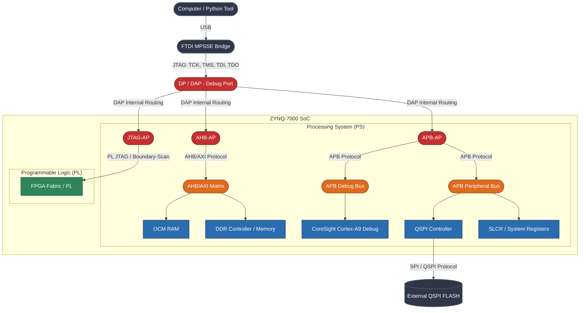

# Zynq-7000 Debug Architecture & CoreSight Topology

This document provides a high-level overview of the ARM CoreSight debug infrastructure embedded within the Xilinx Zynq-7000 SoC. It illustrates how external JTAG commands are routed through the silicon to access internal memory, control processor execution, and interact with peripherals like the QSPI Flash.

---

## 🗺️ System Topology Diagram

The following block diagram illustrates the data path from the host PC down to the internal components of the Zynq-7000 SoC, explicitly showing the protocols and interfaces used at each stage.

## 🧠 Processing System (PS) vs. 🚀 Programmable Logic (PL)

The Zynq architecture is strictly divided into two distinct domains. Understanding this boundary is crucial for low-level debugging:

* **Processing System (PS) — The Software Domain:** 
  The PS is the hard-silicon side of the Zynq, containing the dual-core ARM Cortex-A9 processors, system memories (OCM), and standard peripherals (like the QSPI Controller). Both the **AHB-AP** and **APB-AP** operate entirely within this boundary.
* **Programmable Logic (PL) — The Hardware/FPGA Domain:** 
  The PL is the reprogrammable FPGA fabric. Instead of exposing a separate physical JTAG port, ARM CoreSight embeds the **JTAG-AP**, which acts as an internal bridge to program the PL bitstream or perform Boundary Scans directly through the primary PS JTAG connection.

---

## 🚪 The Access Ports (APs)

Within the CoreSight DAP, the Access Ports act as "gates" bridging the external JTAG interface to the internal hardware buses.

* **DP (Debug Port):** The primary physical interface interacting with your JTAG wires. It exposes the Instruction Register (IR) and Data Register (DR) chains.
* **AHB-AP (Advanced High-performance Bus AP):** Connects directly to the main system interconnect. It treats the entire memory map as raw addresses, allowing high-speed hardware-driven DMA injections (e.g., pushing the `fsbl.bin` into OCM RAM) without engaging the CPUs.
* **APB-AP (Advanced Peripheral Bus AP):** Connects to the CoreSight private debug bus. It is strictly tasked with modifying the processor cores' execution state (Halt, Resume, Breakpoints) and altering memory-mapped peripheral configurations.
* **JTAG-AP:** The internal bridge down to the Programmable Logic (PL) configuration logic.

---

## 🛣️ The Internal Buses

Once past the Access Ports, data travels across specific internal buses optimized for different workloads:

* **AHB / AXI Bus Matrix:** The high-bandwidth backbone of the system. It links the processors, DDR controller, and OCM. This bus supports burst modes, enabling our tool's bulk transfer engine to bypass USB turnaround latency bottlenecks.
* **APB Debug Bus:** A dedicated internal bus reserved strictly for debug components. The APB-AP uses this highway to read/write core registers when the Cortex-A9 is halted.
* **APB Peripheral Bus:** A low-power, point-to-point peripheral bus for configuration registers. The QSPI Controller and SLCR (System Level Control Registers) hang off this bus. 

---

| Feature | AHB-AP (Access Port on AHB Bus) | APB-AP (Access Port on APB Bus) |
| :--- | :--- | :--- |
| **Nature** | Internal **Debug Access Port** inside the DAP. | Internal **Debug Access Port** inside the DAP. |
| **Speed/Bandwidth** | High speed (optimized for bulk memory transfers). | Low speed (optimized for single-register control). |
| **Primary Targets** | On-Chip RAM (OCM), DDR, System Memory. | QSPI Controller, SLCR Registers, Core Debugging. |
| **Tool Usage** | Used to inject the `fsbl.bin` firmware in fast burst blocks. | Used to configure hardware registers and query the QSPI Flash JEDEC ID. |

---

## 📌 What this tool actually exercises

The table above describes the general CoreSight topology available on Zynq-7000 silicon. This specific tool is deliberately simpler than that:

* **A single Access Port does everything.** `coresight_dap.py` opens one AHB-AP memory window (via `connect()`) and uses it for *all* memory-mapped access - OCM, SLCR, and the QSPI controller alike. There is no separate APB-AP transaction path in the code; the distinction in the table above is architectural background, not a description of this codebase's routing.
* **FPGA/PL access bypasses the DAP entirely.** `read_fpga_usercode()` doesn't go through the JTAG-AP bridge shown in the diagram above. Instead, it addresses the FPGA's own TAP directly as a second device in the same physical JTAG chain (`tap_index=0`, versus `tap_index=1` for the ARM DAP) - see `jtag_tap.py::shift_ir()` / `shift_dr()`. This is a simpler and more direct path, and it's why FPGA USERCODE reads work even without ever powering up the CoreSight debug domains.
* **No CoreSight debug-halt/resume is used.** Even CPU control (see [FSBL Injection](fsbl_injection.md)) goes through the SLCR reset line rather than the Cortex-A9's own debug registers.

If you extend this tool to add real per-core debug control (breakpoints, register inspection, single-stepping), that's where you would start using the APB-AP path shown in the table for the first time.