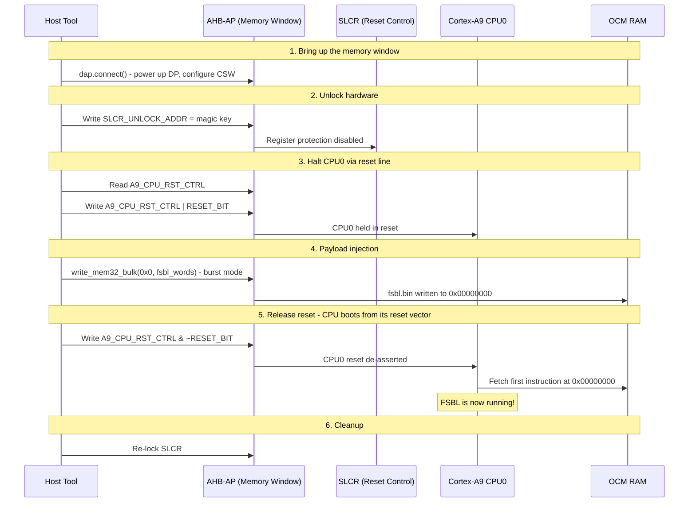

# The Magic of FSBL Injection

One of the most powerful features of this tool is the ability to inject and execute a **First Stage Boot Loader (FSBL)** directly into the Zynq's internal memory via JTAG. This completely bypasses the standard boot sequence (e.g., booting from an SD card or QSPI Flash), which is incredibly useful for "unbricking" boards or debugging early-stage hardware bring-up.

Unlike a traditional debugger, this tool never touches the processor's debug/execution-control registers to start the code running. Instead, it exploits a simpler and more elegant property of the Zynq-7000 reset architecture: **the CPU's reset vector always points to OCM address `0x00000000`.** Whatever code sits there when CPU0 comes out of reset is exactly what it starts executing. No Program Counter hijacking required.

This process is implemented end to end in `zynq_soc.py::load_and_run_fsbl()`.

---

## 🛠️ The Injection Sequence

Here is the exact sequence of operations, as implemented:

1. **Bring up the AHB-AP memory window:** `dap.connect()` resets the TAP and powers up the CoreSight Debug Access Port, giving the tool a raw memory-mapped view of the whole system (OCM, SLCR, peripherals) - one single Access Port is used for every step below.
2. **Unlock the SLCR:** The System Level Control Registers (SLCR) are protected to prevent accidental writes. `slcr_unlock()` sends the documented magic key to the unlock register to gain access to the reset controls.
3. **Halt CPU0:** `_halt_cpu0()` reads `A9_CPU_RST_CTRL` and sets bit 0, asserting the reset line for Cortex-A9 Core 0. A halted-by-reset CPU cannot fetch or execute instructions, so it is now safe to overwrite OCM underneath it.
4. **Bulk Write to OCM:** Using `write_mem32_bulk()`, the tool streams the entire `fsbl.bin` file - packed into 32-bit words - directly into OCM starting at address `0x00000000`. This bypasses per-word JTAG round-trips by batching hundreds of AHB-AP transactions into large MPSSE payloads (see [MPSSE Protocol](mpsse_protocol.md)).
5. **Release CPU0:** `_release_cpu0()` clears the reset bit in `A9_CPU_RST_CTRL`, restoring the register's other bits exactly as they were before step 3. The CPU immediately fetches its first instruction from its reset vector - OCM `0x00000000` - which now holds our freshly injected FSBL.
6. **Re-lock the SLCR** and wait a couple of seconds for the FSBL's own hardware bring-up to settle before the tool considers the board ready.

---

## ⏱️ Sequence Diagram

---

## Why this works without touching CoreSight debug registers

A conventional JTAG debugger halts a core by asserting a debug request through its CoreSight debug registers, then manually loads a new Program Counter before resuming - useful when you need to redirect a *running* core mid-execution. Here we never need that: the core is already about to come out of reset, so all we have to do is control *what code is present at the address it will fetch from first*. Controlling the SLCR reset line and the OCM contents is enough - simpler, and it works even if the CoreSight debug logic itself were never touched at all beyond the plain AHB-AP memory access already needed for every other feature in this tool.
