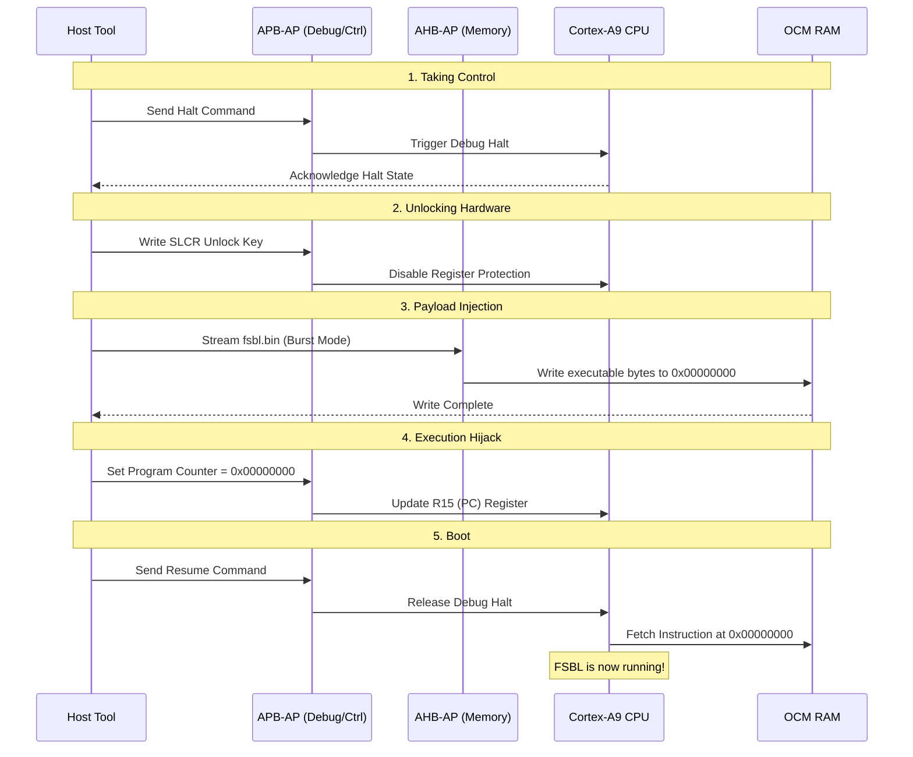

# The Magic of FSBL Injection

One of the most powerful features of this tool is the ability to inject and execute a **First Stage Boot Loader (FSBL)** directly into the Zynq's internal memory via JTAG. This completely bypasses the standard boot sequence (e.g., booting from an SD card or QSPI Flash), which is incredibly useful for "unbricking" boards or debugging early-stage hardware bring-up.

This process involves carefully orchestrating the CoreSight Debug Access Port (DAP) to take control of the main CPU, alter its memory, and force it to execute our code.

---

## 🛠️ The Injection Sequence

Here is the exact sequence of low-level operations performed by the `jtag_controller.py` engine:

1. **Halt the Processor:** Through the **APB-AP**, we write to the ARM CoreSight debug registers to abruptly halt the execution of the Cortex-A9 Core 0.
2. **Unlock the SLCR:** The System Level Control Registers (SLCR) are protected to prevent accidental writes. We send a specific magic key to the SLCR unlock register to gain access to the clock and reset controls.
3. **Bulk Write to OCM:** Using the high-speed **AHB-AP**, we bypass the CPU and use hardware DMA to stream the `fsbl.bin` file directly into the **On-Chip Memory (OCM)**, usually starting at address `0x00000000`.
4. **Hijack the Program Counter (PC):** We write back to the Cortex-A9 debug registers (via APB-AP) to forcefully change the CPU's Program Counter (R15) to point to the starting address of our newly injected FSBL in the OCM.
5. **Resume Execution:** Finally, we release the Halt state. The CPU wakes up, fetches the next instruction from the modified Program Counter, and natively boots our FSBL.

---

## ⏱️ Sequence Diagram

The following diagram illustrates the interaction between the host PC, the JTAG Access Ports, and the Zynq hardware domains during the injection process.

