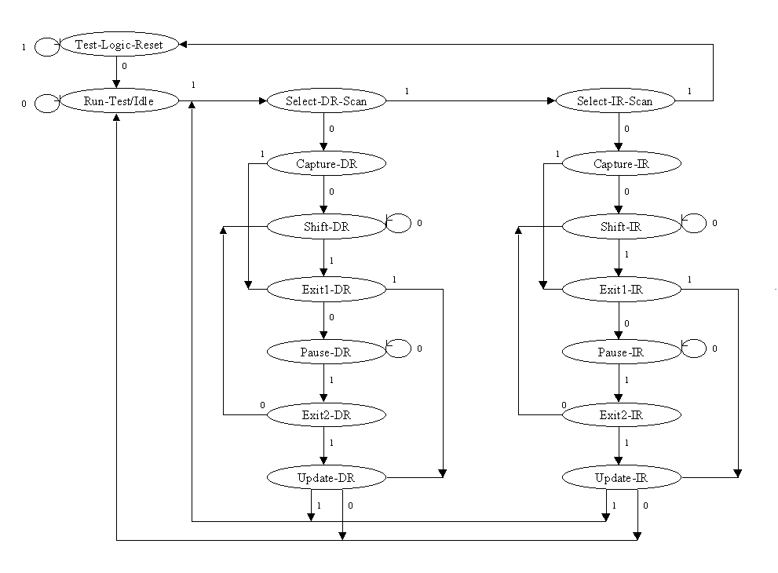

# JTAG Protocol Basics
The Joint Test Action Group (JTAG) standard (IEEE 1149.1) is a synchronous serial interface used for testing, verifying, and debugging printed circuit boards and integrated circuits (even in daisy chain configuration). 

## The 4-Wire Bus Interface
At its core, JTAG uses four mandatory pins:

* **TCK (Test Clock):** Synchronizes the internal state machine operations.
* **TMS (Test Mode Select):** Sampled on the rising edge of TCK to navigate the internal state machine (TAP Controller).
* **TDI (Test Data In):** Serial data shifted into the device.
* **TDO (Test Data Out):** Serial data shifted out of the device.

## The TAP Controller State Machine
Every JTAG-compliant chip contains a 16-states finite state machine called the **Test Access Port (TAP) Controller**. Navigation through these states is controlled entirely by the sequence of `1`s and `0`s sent over the **TMS** (Test Mode Select) signal and occur strictly on the rising edge of the `TCK` (Test Clock) signal.

Our TAP driver in `jtag_tap.py` heavily relies on these specific states:

* **Test-Logic-Reset (TLR):** The safe/reset state. Holding TMS `HIGH` for 5 consecutive clock cycles guarantees a return to TLR from *any* state.
* **Run-Test/Idle:** A resting state where the TAP is active but not shifting data.
* **Shift-IR (Instruction Register):** Used to load a command (e.g., Target the FPGA Usercode or the ARM CoreSight DAP).
* **Shift-DR (Data Register):** Used to read or write the actual data payload based on the active instruction.

As shown in the diagram, the FSM is split into two nearly identical vertical branches:

*   **Instruction Path (IR):** States ending in "-IR". Used to shift control commands into the instruction register.
*   **Data Path (DR):** States ending in "-DR". Used to read from or write to the specific data register targeted by the active instruction.

### Serial Shifting (Shift-IR / Shift-DR)

During `Shift-IR` or `Shift-DR` the TAP shifts one bit per `TCK` rising edge: the controller drives the next bit on `TDI` which is sampled on that rising edge, while the device presents the bit shifted out on `TDO` (so you receive one output bit per clock as well). To shift an N‑bit value keep `TMS = 0` and toggle `TCK` for the first N−1 bits, then set `TMS = 1` on the final clock to exit the shift state and move to `Exit1-DR`/`Exit1-IR` as required.

### Global Controller States

*   **Test-Logic-Reset:** All test logic is disabled in this state, allowing the IC to operate normally. The FSM is designed so that this state can always be reached from *any* current state by holding `TMS` high and pulsing `TCK` five times. Because of this built-in fail-safe, a physical Test Reset (`TRST`) pin is optional.
*   **Run-Test/Idle:** The controller waits here. Test logic in the IC is idle unless a specifically activated instruction (such as a built-in self-test) dictates execution while in this state.

### Path Selection States

*   **Select-DR-Scan:** A temporary decision state that controls whether the FSM will enter the Data Path or proceed to check the Instruction Path.
*   **Select-IR-Scan:** Controls whether the FSM will enter the Instruction Path or return to the `Test-Logic-Reset` state.

### Instruction Register (IR) Path

*   **Capture-IR:** On the rising edge of `TCK`, a fixed pattern of values is parallel-loaded into the shift register bank of the Instruction Register. By JTAG standard, the two least significant bits are always loaded as `01`.
*   **Shift-IR:** The instruction register is connected serially between the `TDI` (input) and `TDO` (output) pins. The captured pattern shifts out on each rising edge of `TCK`, while the new instruction available on the `TDI` pin simultaneously shifts in.
*   **Exit1-IR:** A decision state to either enter `Pause-IR` or proceed directly to `Update-IR`.
*   **Pause-IR:** Allows the shifting process of the instruction register to be temporarily halted without losing data.
*   **Exit2-IR:** Controls whether to return to `Shift-IR` to resume shifting or proceed to `Update-IR`.
*   **Update-IR:** On every *falling* edge of `TCK`, the new instruction is latched into the Instruction Register's latch bank. Once latched, it immediately becomes the active/current instruction.

### Data Register (DR) Path

The Data Path mirrors the structural flow of the Instruction Path, but it operates on the hardware data register that was selected by the current instruction.

*   **Capture-DR:** Hardware data is parallel-loaded into the currently selected data register on the rising edge of `TCK`.
*   **Shift-DR:** Connects the selected data register between `TDI` and `TDO` to shift data in and out.
*   **Exit1-DR / Pause-DR / Exit2-DR:** Function exactly like their IR counterparts, managing the halting, holding, and resuming of data shifting.
*   **Update-DR:** Latches the newly shifted data into the target hardware register.

### Example: Navigating to Shift-DR
To move from `Test-Logic-Reset` to `Shift-DR`, the TMS pin must receive the sequence `0 -> 1 -> 0 -> 0`. In our code this exact sequence is pre-packed as the `TmsCommands.IDLE_TO_SHIFT_DR` MPSSE payload in `zynq_constants.py`, and consumed by `JtagTap._shift_bits()` in `jtag_tap.py` at the start of every DR shift.